# Lista de Exercícios Práticos — Redis CLI

> Execute os comandos no `redis-cli` e adicione os prints dos resultados abaixo de cada exercício.

---

# Exercício 1 — Cadastro de Usuário

## Comandos

```bash
SET usuario "Carlos"
GET usuario

SET usuario "Carlos Silva"
GET usuario
```

## Prints

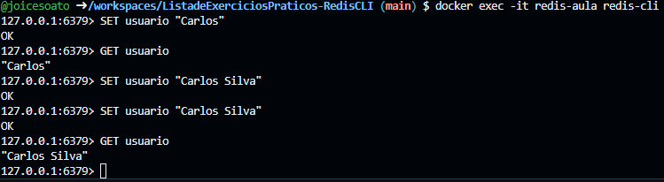

---

# Exercício 2 — Cadastro de Produto

## Comandos

```bash
MSET produto "Notebook" preco "3500" estoque "15"

MGET produto preco estoque
```

## Prints

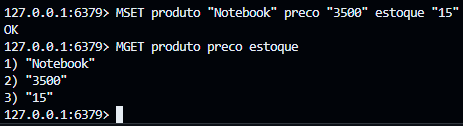

---

# Exercício 3 — Controle de Login

## Comandos

```bash
SETNX admin "true"

SETNX admin "false"

GET admin
```

## Prints

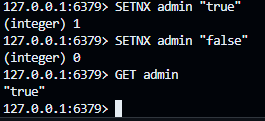

---

# Exercício 4 — Nome Completo

## Comandos

```bash
SET nome "Maria"

APPEND nome " Oliveira"

STRLEN nome

GETRANGE nome 0 4
```

## Prints

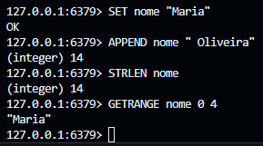

---

# Exercício 5 — Alteração Parcial

## Comandos

```bash
SET cidade "Campinas"

SETRANGE cidade 0 "São "

GET cidade
```

## Prints

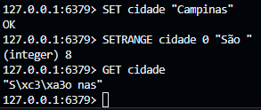

> Observação:
> O comando `SETRANGE` opera em bytes. Como o caractere `ã`
> utiliza múltiplos bytes em UTF-8, o resultado pode aparecer
> como `"S\xc3\xa3o nas"` dependendo do terminal utilizado.

---

# Exercício 6 — Sistema de Pontuação

## Comandos

```bash
SET pontos 10

INCR pontos

INCRBY pontos 5

DECRBY pontos 3

GET pontos
```

## Prints

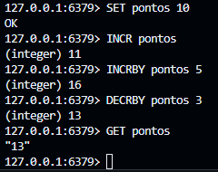

---

# Exercício 7 — Carteira Digital

## Comandos

```bash
SET saldo 100.50

INCRBYFLOAT saldo 25.75

GET saldo
```

## Prints

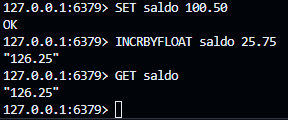

---

# Exercício 8 — Token Temporário

## Comandos

```bash
SET token "abc123" EX 60

TTL token

PERSIST token

TTL token
```

## Prints

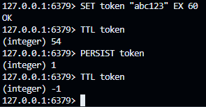

---

# Exercício 9 — Expiração em Milissegundos

## Comandos

```bash
SET sessao "ativa"

PEXPIRE sessao 5000

PTTL sessao
```

## Prints

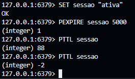

---

# Exercício 10 — Gerenciamento de Chaves

## Comandos

```bash
SET curso "Redis"

RENAME curso disciplina

COPY disciplina backup_disciplina

TYPE disciplina

EXISTS disciplina

DEL disciplina
```

## Prints

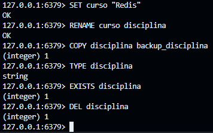

---

# Exercício 11 — Banco Redis

## Comandos

```bash
SET chave_teste "valor"

MOVE chave_teste 1

SELECT 1

GET chave_teste
```

## Prints

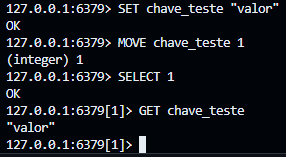

---

# Exercício 12 — Listagem de Chaves

## Comandos

```bash
SET chave1 "A"
SET chave2 "B"
SET chave3 "C"
SET chave4 "D"
SET chave5 "E"

KEYS *

SCAN 0
```

## Prints

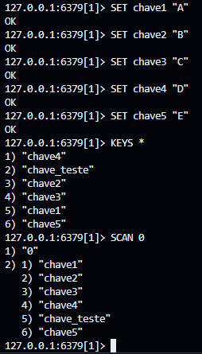

---

# Exercício 13 — Lista de Tarefas

## Comandos

```bash
RPUSH tarefas "Estudar Redis"
RPUSH tarefas "Fazer Exercícios"
RPUSH tarefas "Dormir"

LRANGE tarefas 0 -1
```

## Prints

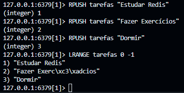

---

# Exercício 14 — Controle de Fila

## Comandos

```bash
LLEN tarefas

LINDEX tarefas 0

LINDEX tarefas -1
```

## Prints

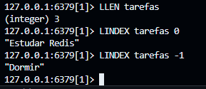

---

# Exercício 15 — Alteração de Item

## Comandos

```bash
LSET tarefas 1 "Fazer Projeto"

LRANGE tarefas 0 -1
```

## Prints

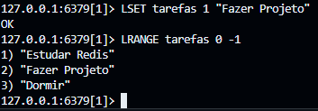

---

# Exercício 16 — Inserção Estratégica

## Comandos

```bash
LINSERT tarefas BEFORE "Dormir" "Tomar Café"

LRANGE tarefas 0 -1
```

## Prints

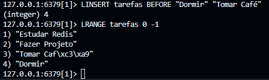

---

# Exercício 17 — Remoção de Elementos

## Comandos

```bash
LPOP tarefas

RPOP tarefas

LRANGE tarefas 0 -1
```

## Prints

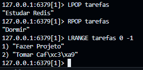
---

# Exercício 18 — Movendo Itens Entre Filas

## Comandos

```bash
RPUSH fila_atividade_pendente "Atividade 1"
RPUSH fila_atividade_pendente "Atividade 2"

LMOVE fila_atividade_pendente fila_atividade_processando LEFT RIGHT

LRANGE fila_atividade_pendente 0 -1

LRANGE fila_atividade_processando 0 -1
```

## Prints

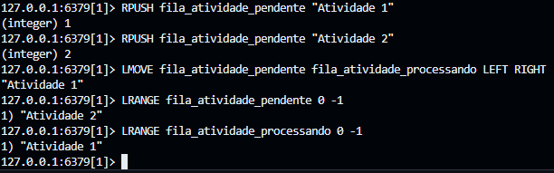

---

# Exercício 19 — Histórico Limitado

## Comandos

```bash
RPUSH logs "cmd1"
RPUSH logs "cmd2"
RPUSH logs "cmd3"
RPUSH logs "cmd4"
RPUSH logs "cmd5"
RPUSH logs "cmd6"
RPUSH logs "cmd7"
RPUSH logs "cmd8"
RPUSH logs "cmd9"
RPUSH logs "cmd10"

LTRIM logs -5 -1

LRANGE logs 0 -1
```

## Prints

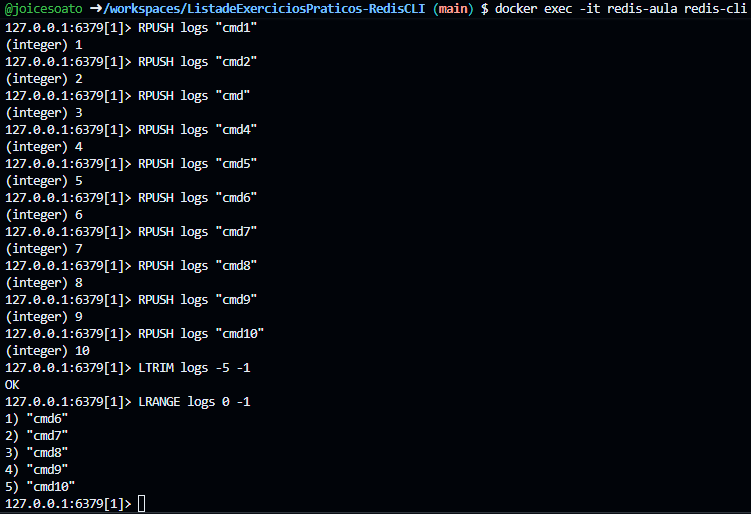

---

# Exercício 20 — Remoção por Valor

## Comandos

```bash
RPUSH tarefas "Dormir"
RPUSH tarefas "Dormir"
RPUSH tarefas "Dormir"

LREM tarefas 1 "Dormir"

LRANGE tarefas 0 -1

LREM tarefas 0 "Dormir"

LRANGE tarefas 0 -1
```

## Prints

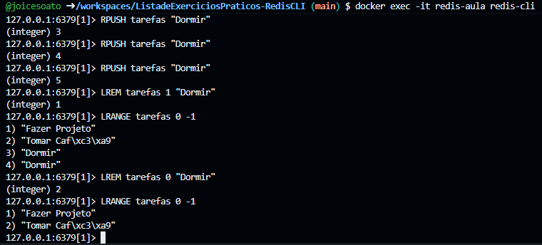

---

# Exercício 21 — Localização de Elementos

## Comandos

```bash
LPOS tarefas "Estudar Redis"

LPOS tarefas "Dormir" COUNT 10
```

## Prints

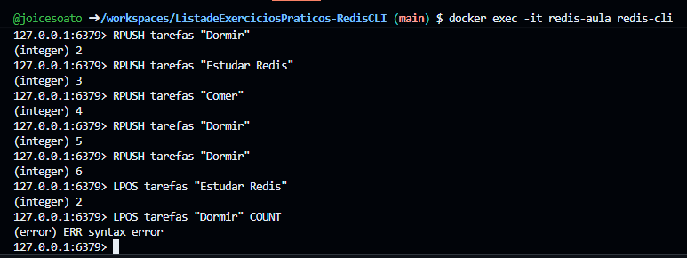

---

# Exercício 22 — Remoção Múltipla

## Comandos

```bash
LPUSH tarefas "Item1" "Item2" "Item3" "Item4"

LTRIM tarefas 0 1

LRANGE tarefas 0 -1
```

## Prints

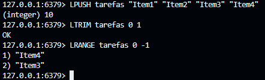

---

# Exercício 23 — Expiração em Listas

## Comandos

```bash
RPUSH lista_temporaria "A"
RPUSH lista_temporaria "B"

EXPIRE lista_temporaria 10

TTL lista_temporaria

EXISTS lista_temporaria
```

## Prints

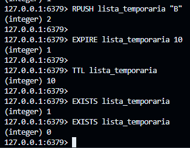